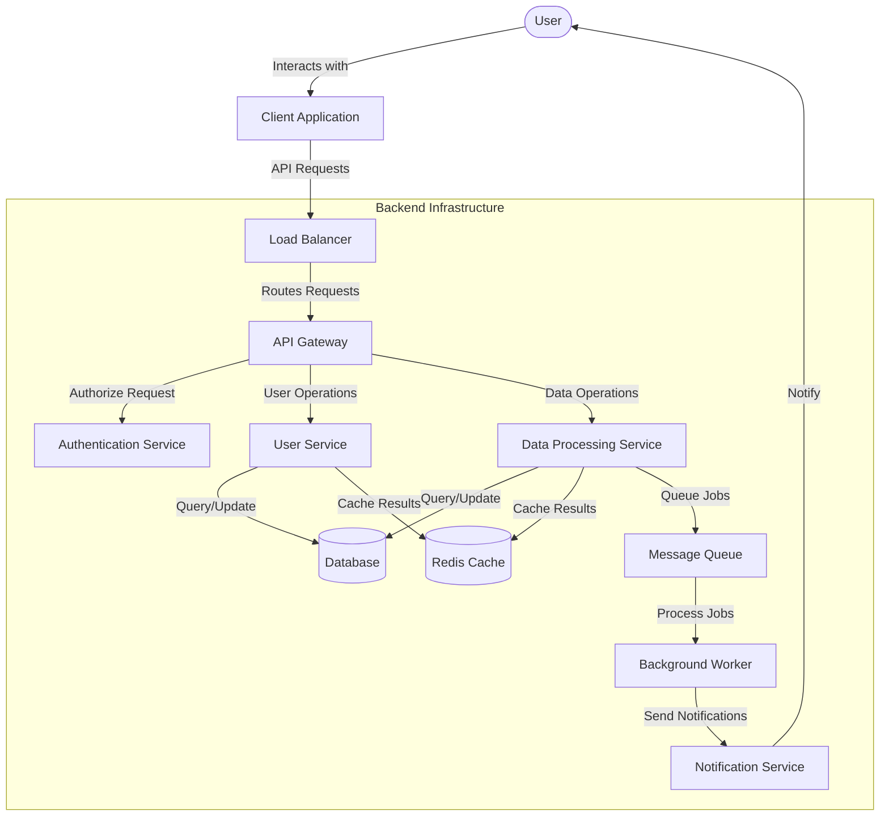
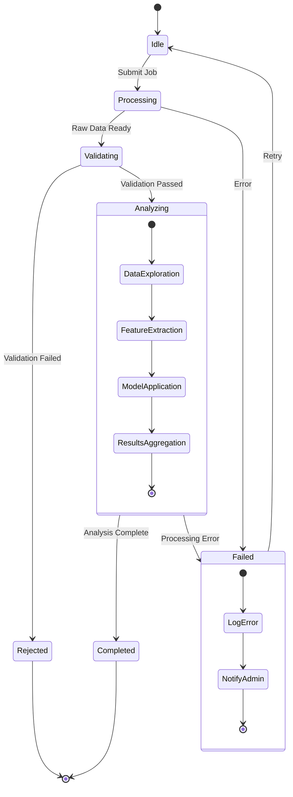
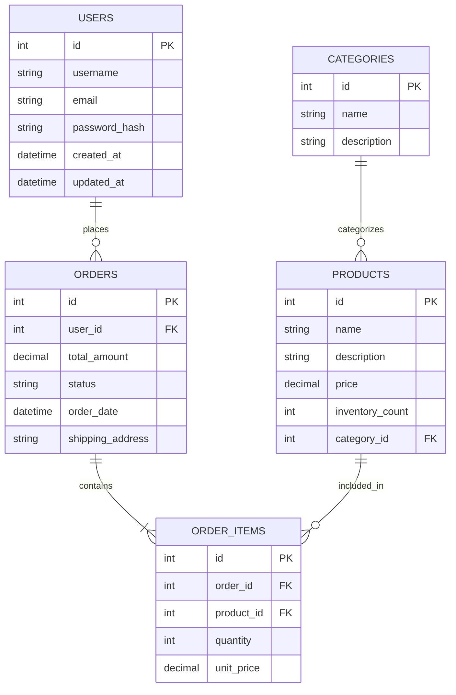

# Advanced Documentation System Guide

This document demonstrates the capabilities of our documentation system, including standard Markdown features and interactive components for technical documentation.

## Core Markdown Features

### Text Formatting

Basic formatting includes **bold text**, *italic text*, and ~~strikethrough~~. You can also use `inline code` for technical references.

### Headings and Structure

Proper document structure improves readability and navigation:

#### Level 4 Heading
##### Level 5 Heading
###### Level 6 Heading

### Code Blocks with Syntax Highlighting

```python
def fibonacci(n):
    """Generate the Fibonacci sequence up to n terms."""
    sequence = [0, 1]
    if n <= 2:
        return sequence[:n]
    
    for i in range(2, n):
        next_value = sequence[i-1] + sequence[i-2]
        sequence.append(next_value)
    
    return sequence

# Example usage
fibonacci_sequence = fibonacci(10)
print(f"First 10 Fibonacci numbers: {fibonacci_sequence}")
```

```javascript
// Event listener with promise handling
document.getElementById('dataButton').addEventListener('click', async () => {
  try {
    const response = await fetch('https://api.example.com/data');
    if (!response.ok) {
      throw new Error(`HTTP error: ${response.status}`);
    }
    const data = await response.json();
    
    // Process and display the data
    renderDataTable(data);
  } catch (error) {
    console.error('Failed to fetch data:', error);
    displayErrorNotification(error.message);
  }
});
```

### Mathematical Expressions

Inline math is rendered like this: $f(x) = x^2 - 3x + 2$

Display equations are centered and stand on their own:

$$
\begin{aligned}
\nabla \times \vec{E} &= -\frac{\partial \vec{B}}{\partial t} \\
\nabla \times \vec{B} &= \mu_0 \vec{J} + \mu_0 \varepsilon_0 \frac{\partial \vec{E}}{\partial t}
\end{aligned}
$$

Complex equations with matrices:

$$
A = \begin{pmatrix}
a_{11} & a_{12} & \cdots & a_{1n} \\
a_{21} & a_{22} & \cdots & a_{2n} \\
\vdots & \vdots & \ddots & \vdots \\
a_{m1} & a_{m2} & \cdots & a_{mn}
\end{pmatrix}
$$

### Tables with Alignment

| Method | Time Complexity | Space Complexity | Stability |
|:-------|:---------------:|:----------------:|----------:|
| Bubble Sort | $O(n^2)$ | $O(1)$ | Stable |
| Quick Sort | $O(n \log n)$ | $O(\log n)$ | Unstable |
| Merge Sort | $O(n \log n)$ | $O(n)$ | Stable |
| Heap Sort | $O(n \log n)$ | $O(1)$ | Unstable |
| Counting Sort | $O(n + k)$ | $O(n + k)$ | Stable |

### Lists and Nested Structure

#### Ordered Lists

1. Project Setup
   1. Clone repository: `git clone https://github.com/username/project.git`
   2. Install dependencies: `npm install` or `pip install -r requirements.txt`
2. Configuration
   1. Create configuration file from template
   2. Set environment variables
      - Development environment
      - Production environment
3. Deployment
   - Testing environment: `make deploy-test`
   - Production: `make deploy-prod`

#### Unordered Lists

* Backend
  * API Services
    * Authentication
    * Data Processing
    * Notification System
  * Database
    * Schema Design
    * Query Optimization
* Frontend
  * UI Components
  * State Management
  * Routing

### Blockquotes and Callouts

> **Important:** This is a critical note that requires attention.
> 
> Multiple paragraphs can be included in a blockquote for extended explanations or warnings.

## Interactive Components

### GLSL Shader Visualization

Interactive shader with UI controls:

```glsl
precision mediump float;

uniform float u_time;
uniform vec2 u_resolution;
uniform vec2 u_mouse;
uniform float u_mouseDown;

void main() {
    vec2 st = gl_FragCoord.xy/u_resolution.xy;
    
    float frequency = 20.0;
    float amplitude = 0.1;
    
    // Create a grid pattern
    vec2 grid = fract(st * frequency);
    float gridLines = smoothstep(0.0, 0.05, grid.x) * smoothstep(0.0, 0.05, grid.y);
    
    // Create waves based on distance from mouse
    float dist = distance(st, u_mouse);
    float waveFactor = sin(dist * 50.0 - u_time * 2.0) * amplitude;
    
    // Mix colors based on position and time
    vec3 color1 = vec3(0.2, 0.4, 0.8);
    vec3 color2 = vec3(0.8, 0.3, 0.2);
    vec3 color = mix(color1, color2, st.x + waveFactor);
    
    // Add wave effect to grid
    color *= (0.7 + waveFactor + 0.3);
    
    // Enhance with grid lines
    color = mix(color, vec3(1.0), gridLines * 0.2);
    
    // Enhance effect when mouse is pressed
    if (u_mouseDown > 0.5) {
        float halo = smoothstep(0.3, 0.0, dist);
        color = mix(color, vec3(1.0, 1.0, 0.5), halo * 0.5);
    }
    
    gl_FragColor = vec4(color, 1.0);
}
```

Clean, minimal shader without UI controls:

```glsl noui
precision mediump float;

uniform float u_time;
uniform vec2 u_resolution;

void main() {
    vec2 st = gl_FragCoord.xy/u_resolution.xy;
    
    // Color based on position
    vec3 color = vec3(st.x, st.y, abs(sin(u_time * 0.5)));
    
    // Add circular pattern
    float d = distance(st, vec2(0.5));
    float circle = smoothstep(0.3, 0.31, d) * smoothstep(0.4, 0.39, d);
    
    color = mix(color, vec3(1.0) - color, circle);
    
    gl_FragColor = vec4(color, 1.0);
}
```

### Interactive Mathematical Graphing

```desmos
{
  "width": "700px",
  "height": "400px",
  "expressions": true,
  "expressionsList": [
    { "id": "graph1", "latex": "y=a\\sin(bx+c)+d" },
    { "id": "graph2", "latex": "y=mx+b", "color": "#c74440" },
    { "id": "intersection", "latex": "\\sin(\\frac{yx-b}{a}) = \\frac{mx+b-d}{a}", "color": "#2d70b3", "hidden": true }
  ],
  "bounds": {
    "left": -10,
    "right": 10,
    "bottom": -5,
    "top": 5
  },
  "interactive": true,
  "parameters": [
    { "id": "a", "name": "Sine Amplitude", "min": 0.1, "max": 5, "default": 1 },
    { "id": "b", "name": "Sine Frequency", "min": 0.1, "max": 10, "default": 1 },
    { "id": "c", "name": "Sine Phase Shift", "min": -3.14, "max": 3.14, "default": 0 },
    { "id": "d", "name": "Sine Vertical Shift", "min": -5, "max": 5, "default": 0 },
    { "id": "m", "name": "Line Slope", "min": -5, "max": 5, "default": 1 },
    { "id": "b", "name": "Line y-intercept", "min": -5, "max": 5, "default": 0 }
  ]
}
```

### Diagrams and Flowcharts

#### System Architecture Diagram



#### State Machine Diagram



#### Database Schema Diagram



### Geometry and Mathematics Visualization

```geogebra
{
  "width": 650,
  "height": 500,
  "showToolBar": true,
  "showAlgebraInput": true,
  "showMenuBar": false,
  "showResetIcon": true,
  "enableLabelDrags": false,
  "enableShiftDragZoom": true,
  "enableRightClick": false,
  "appletCode": "Circle[(0,0), radius];\nPolygon[(-2,-2), (2,-2), (2,2), (-2,2)];\nPoint(-3,1);\nSlider[-5, 5, 0.1, 1, angle];\nRotate[Circle[(0,0), radius], angle, (0,0)]",
  "parameters": [
    { "id": "radius", "name": "Circle Radius", "min": 1, "max": 5, "default": 3 },
    { "id": "angle", "name": "Rotation Angle", "min": 0, "max": 6.28, "default": 0 }
  ]
}
```

### Interactive Programming with p5.js

```p5js
const sketch = (p) => {
  let particles = [];
  const numParticles = 100;
  let attractionPoint;
  let repulsionActive = false;
  let colorMode = 0;

  p.setup = () => {
    p.createCanvas(600, 400);

    for (let i = 0; i < numParticles; i++) {
      particles.push({
        position: p.createVector(p.random(p.width), p.random(p.height)),
        velocity: p.createVector(p.random(-0.5, 0.5), p.random(-0.5, 0.5)),
        size: p.random(4, 12),
        color: p.color(p.random(100, 255), p.random(100, 255), p.random(100, 255))
      });
    }

    attractionPoint = p.createVector(p.width / 2, p.height / 2);
  };

  p.draw = () => {
    p.background(20, 40);

    if (p.mouseX > 0 && p.mouseY > 0) {
      attractionPoint.x = p.mouseX;
      attractionPoint.y = p.mouseY;
    }

    p.stroke(repulsionActive ? 255 : 0, repulsionActive ? 0 : 255, 255);
    p.strokeWeight(2);
    p.noFill();
    p.ellipse(attractionPoint.x, attractionPoint.y, 30, 30);

    for (let particle of particles) {
      let force = p5.Vector.sub(attractionPoint, particle.position);
      let distance = force.mag();
      let strength = p.constrain(50 / (distance * distance), 0, 0.7);
      force.normalize();

      if (repulsionActive) {
        force.mult(-strength);
      } else {
        force.mult(strength);
      }

      particle.velocity.add(force);
      particle.velocity.limit(3);
      particle.position.add(particle.velocity);

      if (particle.position.x < 0 || particle.position.x > p.width) {
        particle.velocity.x *= -0.8;
      }
      if (particle.position.y < 0 || particle.position.y > p.height) {
        particle.velocity.y *= -0.8;
      }

      particle.position.x = p.constrain(particle.position.x, 0, p.width);
      particle.position.y = p.constrain(particle.position.y, 0, p.height);

      p.noStroke();

      if (colorMode === 0) {
        p.fill(particle.color);
      } else if (colorMode === 1) {
        p.fill(
          p.map(p.abs(particle.velocity.x), 0, 3, 50, 255),
          p.map(p.abs(particle.velocity.y), 0, 3, 50, 255),
          p.map(particle.velocity.mag(), 0, 3, 100, 255)
        );
      } else {
        let d = p.dist(particle.position.x, particle.position.y, attractionPoint.x, attractionPoint.y);
        p.fill(
          p.map(d, 0, 300, 0, 255),
          p.map(d, 0, 300, 255, 0),
          150
        );
      }

      p.circle(particle.position.x, particle.position.y, particle.size);
    }

    p.fill(255);
    p.noStroke();
    p.text("Click to toggle attraction/repulsion", 10, 20);
    p.text("Press 'c' to change color mode", 10, 40);
  };

  p.mousePressed = () => {
    repulsionActive = !repulsionActive;
  };

  p.keyPressed = () => {
    if (p.key === 'c' || p.key === 'C') {
      colorMode = (colorMode + 1) % 3;
    }
  };
};

new p5(sketch);
```

## Documentation Best Practices

### Creating Effective Technical Documentation

1. **Know your audience**: Tailor the complexity and terminology to your readers' expertise
2. **Use consistent structure**: Maintain a logical organization with clear headings
3. **Include practical examples**: Provide real-world code samples and use cases
4. **Create visual aids**: Use diagrams, flowcharts, and illustrations for complex concepts
5. **Document assumptions**: Clearly state any assumptions or prerequisites
6. **Keep it updated**: Ensure documentation evolves with your codebase

### Advanced Topic Navigation

Create proper navigation between sections using internal links:

- [Core Markdown Features](#core-markdown-features)
- [Interactive Components](#interactive-components)
- [Documentation Best Practices](#documentation-best-practices)

### Embedding External Resources

Reference external resources to provide additional context:

- [Markdown Guide](https://www.markdownguide.org/)
- [KaTeX Documentation](https://katex.org/docs/supported.html)
- [JavaScript MDN Docs](https://developer.mozilla.org/en-US/docs/Web/JavaScript)

## Component Configuration Reference

### GLSL Shader Options

| Option | Format | Description |
|--------|--------|-------------|
| Standard | ```glsl | Full-featured shader with UI controls |
| Simple | ```glsl simple | Basic shader with minimal UI |
| No UI | ```glsl noui | Raw shader without any UI elements |
| Custom Size | ```glsl simple 800x600 | Specify custom dimensions |

### Interactive Component Properties

| Component | Properties | Required | Optional |
|-----------|------------|----------|----------|
| Desmos | expressionsList | width, height, bounds, parameters |
| Mermaid | diagram definition | theme | 
| GeoGebra | width, height | showToolBar, showAlgebraInput, parameters |
| p5.js | setup(), draw() functions | event handlers, additional functions |

## Conclusion

This documentation demonstrates how to leverage a robust set of features to create engaging and informative technical documentation. By combining standard Markdown with interactive components, you can create rich, dynamic content that enhances understanding and engagement.

For implementation details, consult the API reference or reach out to the development team.