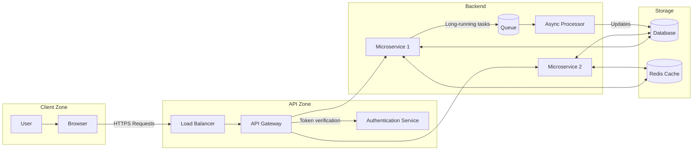

# Documentation Style Guide

This guide showcases the Markdown features and interactive components available in our documentation system.

## Basic Elements

You can use **bold**, *italic*, or `code` text. These styles help highlight important terms.

## Code Examples

```python
def fibonacci(n):
    if n <= 1:
        return n
    return fibonacci(n-1) + fibonacci(n-2)

# Calculate the first 10 Fibonacci numbers
fib_sequence = [fibonacci(i) for i in range(10)]
print(fib_sequence)  # [0, 1, 1, 2, 3, 5, 8, 13, 21, 34]
```

```javascript
// Asynchronous calculation with error handling
async function processData(dataset) {
  try {
    const results = await Promise.all(
      dataset.map(async (item) => {
        const response = await fetch(`https://api.example.com/${item.id}`);
        if (!response.ok) throw new Error(`API error: ${response.status}`);
        return response.json();
      })
    );
    return results.filter(result => result.value > 0);
  } catch (error) {
    console.error("Processing failed:", error);
    return [];
  }
}
```

## Mathematical Expressions

Inline formula: $F = G\frac{m_1 m_2}{r^2}$

Centered equation:

$
\int_{-\infty}^{\infty} e^{-x^2} dx = \sqrt{\pi}
$

## Tables

| Algorithm | Time Complexity | Space Complexity | Stable |
|:----------|:---------------:|:----------------:|:------:|
| Quicksort | $O(n \log n)$ | $O(\log n)$ | No |
| Heapsort | $O(n \log n)$ | $O(1)$ | No |
| Mergesort | $O(n \log n)$ | $O(n)$ | Yes |

## Structured Lists

1. Initial Setup
   - Install dependencies
   - Configure environment
2. Implementation
   - Backend development
   - API integration
   - Unit testing

## Interactive Components

### Solar System in GLSL

```glsl
precision mediump float;

uniform float u_time;
uniform vec2 u_resolution;
uniform vec2 u_mouse;

const float PI = 3.14159265359;

// Function to draw a circle
float circle(vec2 st, vec2 center, float radius) {
    float dist = distance(st, center);
    return smoothstep(radius + 0.005, radius - 0.005, dist);
}

// Function to create a halo around a circle
float halo(vec2 st, vec2 center, float radius, float intensity) {
    float dist = distance(st, center);
    return smoothstep(radius + 0.1, radius, dist) * intensity;
}

void main() {
    vec2 st = gl_FragCoord.xy / u_resolution.xy;
    st.x *= u_resolution.x / u_resolution.y;
    
    // Normalized center point (0.5, 0.5)
    vec2 center = vec2(0.5 * u_resolution.x / u_resolution.y, 0.5);
    
    // Background color - space
    vec3 color = vec3(0.0, 0.01, 0.05);
    
    // Add stars
    for (int i = 0; i < 10; i++) {
        float starX = fract(sin(float(i) * 378.5) * 43758.5453);
        float starY = fract(cos(float(i) * 378.5) * 43758.5453);
        vec2 starPos = vec2(starX, starY);
        
        float brightness = 0.5 + 0.5 * sin(u_time + float(i));
        float starSize = 0.002 * brightness;
        
        color += vec3(0.8, 0.8, 1.0) * circle(st, starPos, starSize) * brightness;
    }
    
    // Sun
    vec2 sunPos = center;
    vec3 sunColor = vec3(1.0, 0.7, 0.0);
    float sun = circle(st, sunPos, 0.1);
    float sunHalo = halo(st, sunPos, 0.1, 0.5);
    color += sunColor * (sun + sunHalo);
    
    // Earth
    float earthOrbitRadius = 0.3;
    float earthTime = u_time * 0.5;
    vec2 earthPos = sunPos + vec2(
        earthOrbitRadius * cos(earthTime),
        earthOrbitRadius * sin(earthTime)
    );
    vec3 earthColor = vec3(0.0, 0.5, 1.0);
    float earth = circle(st, earthPos, 0.03);
    float earthHalo = halo(st, earthPos, 0.03, 0.2);
    color += earthColor * (earth + earthHalo);
    
    // Moon
    float moonOrbitRadius = 0.06;
    float moonTime = u_time * 2.0;
    vec2 moonPos = earthPos + vec2(
        moonOrbitRadius * cos(moonTime),
        moonOrbitRadius * sin(moonTime)
    );
    vec3 moonColor = vec3(0.8, 0.8, 0.8);
    float moon = circle(st, moonPos, 0.01);
    color += moonColor * moon;
    
    // Orbit trajectories (dotted lines)
    float earthOrbit = smoothstep(earthOrbitRadius + 0.003, earthOrbitRadius - 0.003, 
                                 abs(distance(st, sunPos) - earthOrbitRadius));
    earthOrbit *= 0.5 + 0.5 * sin(st.x * 50.0 + u_time);
    color += vec3(0.3) * earthOrbit * 0.2;
    
    gl_FragColor = vec4(color, 1.0);
}
```

### Minimalist Planetary Visualization

```glsl noui
precision mediump float;

uniform float u_time;
uniform vec2 u_resolution;

void main() {
    vec2 st = gl_FragCoord.xy / u_resolution.xy;
    
    // Normalize coordinates
    vec2 centered = st - 0.5;
    centered.x *= u_resolution.x / u_resolution.y;
    
    // Starry background
    vec3 color = vec3(0.01, 0.01, 0.05);
    
    // Planet
    float radius = 0.25;
    float dist = length(centered);
    
    // Planet disc
    if (dist < radius) {
        // Surface pattern
        float bands = sin(centered.y * 20.0 + u_time * 0.2) * 0.05;
        float spots = sin(centered.x * 15.0) * sin(centered.y * 15.0) * 0.05;
        
        // Base color - gas giant
        vec3 planetColor = vec3(0.4 + bands, 0.3 + spots, 0.6);
        
        // Shadow on one side
        float shadow = 0.5 + 0.5 * sin(centered.x * 3.14159 + u_time * 0.5);
        planetColor *= shadow;
        
        color = planetColor;
    } 
    // Atmospheric halo
    else if (dist < radius + 0.05) {
        float glow = 1.0 - (dist - radius) / 0.05;
        color += vec3(0.2, 0.1, 0.5) * glow * glow;
    }
    
    gl_FragColor = vec4(color, 1.0);
}
```

### Equation Graph

```desmos
{
  "width": "500px",
  "height": "300px",
  "expressionsList": [
    { "id": "wave", "latex": "y=a*sin(bx+c)*e^{-dx^2}" },
    { "id": "envelope", "latex": "y=\\pm a*e^{-dx^2}", "color": "#880000", "lineStyle": "DASHED" }
  ],
  "bounds": {
    "left": -5,
    "right": 5,
    "bottom": -2,
    "top": 2
  },
  "parameters": [
    { "id": "a", "name": "Amplitude", "min": 0.1, "max": 3, "default": 1.5 },
    { "id": "b", "name": "Frequency", "min": 1, "max": 10, "default": 6 },
    { "id": "c", "name": "Phase", "min": -3.14, "max": 3.14, "default": 0 },
    { "id": "d", "name": "Damping", "min": 0.01, "max": 1, "default": 0.3 }
  ]
}
```

### System Diagram



### Interactive P5.js Animation

```p5js
// Interactive particle system with attraction
let particles = [];
const numParticles = 80;
let attractionPoint;
let repulsionActive = false;

function setup() {
  createCanvas(500, 300);
  colorMode(HSB, 360, 100, 100, 1);
  
  // Initialize particles with random positions and velocities
  for (let i = 0; i < numParticles; i++) {
    particles.push({
      position: createVector(random(width), random(height)),
      velocity: createVector(random(-1, 1), random(-1, 1)),
      size: random(4, 12),
      hue: (i * 3) % 360,
      maxSpeed: random(2, 5)
    });
  }
  
  // Initial attraction point at center
  attractionPoint = createVector(width/2, height/2);
}

function draw() {
  // Semi-transparent background for trail effect
  background(0, 0, 15, 0.15);
  
  // Update attraction point with mouse position
  if (mouseX > 0 && mouseY > 0 && mouseX < width && mouseY < height) {
    attractionPoint.x = mouseX;
    attractionPoint.y = mouseY;
  }
  
  // Draw attraction point indicator
  noFill();
  if (repulsionActive) {
    stroke(0, 100, 100); // Red
    strokeWeight(2);
    circle(attractionPoint.x, attractionPoint.y, 30);
    line(attractionPoint.x - 10, attractionPoint.y, attractionPoint.x + 10, attractionPoint.y);
  } else {
    stroke(200, 100, 100); // Blue-green
    strokeWeight(2);
    circle(attractionPoint.x, attractionPoint.y, 30);
    line(attractionPoint.x - 10, attractionPoint.y, attractionPoint.x + 10, attractionPoint.y);
    line(attractionPoint.x, attractionPoint.y - 10, attractionPoint.x, attractionPoint.y + 10);
  }

  // Update and draw each particle
  particles.forEach(particle => {
    // Calculate attraction/repulsion force
    let force = p5.Vector.sub(attractionPoint, particle.position);
    let distance = force.mag();
    let strength = constrain(50 / (distance * distance), 0, 0.7);
    force.normalize();
    
    // Apply attraction or repulsion based on active mode
    if (repulsionActive) {
      force.mult(-strength);
    } else {
      force.mult(strength);
    }
    
    // Update velocity and position
    particle.velocity.add(force);
    particle.velocity.limit(particle.maxSpeed);
    particle.position.add(particle.velocity);
    
    // Bounce at edges
    if (particle.position.x < 0 || particle.position.x > width) {
      particle.velocity.x *= -0.8;
    }
    if (particle.position.y < 0 || particle.position.y > height) {
      particle.velocity.y *= -0.8;
    }
    
    // Constrain position to canvas limits
    particle.position.x = constrain(particle.position.x, 0, width);
    particle.position.y = constrain(particle.position.y, 0, height);
    
    // Calculate color based on speed
    let speed = particle.velocity.mag();
    let brightness = map(speed, 0, particle.maxSpeed, 40, 100);
    
    // Draw the particle
    noStroke();
    fill(particle.hue, 80, brightness, 0.8);
    circle(particle.position.x, particle.position.y, particle.size);
  });
  
  // Instructions
  fill(0, 0, 100, 0.8);
  noStroke();
  textSize(12);
  text("Click to toggle between attraction and repulsion", 10, 20);
}

function mousePressed() {
  // Toggle between attraction and repulsion modes
  repulsionActive = !repulsionActive;
}
```


{width=800,height=450,autoplay,muted}

## Links and References

- [Document Structure](#basic-elements)
- [Complete Markdown Guide](https://www.markdownguide.org/getting-started/)
- [MDN JavaScript Documentation](https://developer.mozilla.org/en-US/docs/Web/JavaScript)

## Component Reference

| Component | Format | Description |
|-----------|--------|-------------|
| GLSL | ```glsl | Interactive shader with controls |
| Minimal GLSL | ```glsl noui | Shader without interface |
| Desmos | ```desmos | Interactive math graph |
| Mermaid | ```mermaid | Diagrams and flowcharts |
| P5.js | ```p5js | Interactive JavaScript sketches |