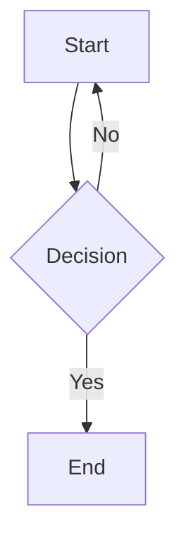

# mdoc

[](https://ko-fi.com/T6T1X1T51) 

A lightweight, minimalist documentation system that converts Markdown files to beautifully rendered web pages with comprehensive analytics, theming, and interactive components.

## Features

### Core Documentation
- **Markdown to HTML conversion** with LaTeX math support via KaTeX
- **Clean, responsive design** with dark/light theme toggle
- **Built-in search functionality** for quick document navigation
- **Code syntax highlighting** for multiple programming languages
- **Cross-reference system** using `[[Document Name]]` syntax
- **Version tracking** using Git history with contributor attribution

### Analytics & Insights
- **Page view tracking** with SQLite/MySQL database support
- **Popular documents dashboard** showing most viewed content
- **Recently updated badges** for documents modified within 1 day/week
- **Contributor tracking** with GitHub integration
- **Document authorship** display with author profiles

### Interactive Components
- **GLSL shaders** with live rendering and interaction
- **Mathematical graphing** with Desmos integration
- **Diagrams and flowcharts** with Mermaid
- **Geometry visualization** with GeoGebra
- **Creative coding** with p5.js sketches

### Developer Experience
- **API endpoints** for programmatic access to documents and analytics
- **Sitemap generation** for SEO optimization
- **GitHub integration** with edit links and issue reporting
- **Discord webhook support** for notifications
- **Folder-based categorization** for document organization

## Quick Start

1. **Clone the repository**
   ```bash
   git clone https://github.com/Meekiavelique/mdoc.git
   cd mdoc
   ```

2. **Install dependencies**
   ```bash
   pip install -r requirements.txt
   ```

3. **Run the application**
   ```bash
   python -m api.app
   ```

4. **Visit** `http://localhost:5000`

## Configuration

### Database Setup
Configure your analytics database in `api/config.py`:

```python
# SQLite (default)
DATABASE_CONFIG = {
    'type': 'sqlite',
    'path': 'api/data/analytics.db'
}

# MySQL/MariaDB
DATABASE_CONFIG = {
    'type': 'mysql',
    'host': 'your-server-ip',
    'port': 3306,
    'database': 'mdoc_analytics',
    'username': 'your-username',
    'password': 'your-password'
}
```

### Site Configuration
```python
SITE_CONFIG = {
    'title': 'Your Documentation Site',
    'description': 'Your site description',
    'base_url': 'https://your-domain.com',
    'github_edit_base': 'https://github.com/your-repo/edit/main/api/templates/docs'
}
```

## Adding Documentation

### Via Pull Request
1. Fork the repository
2. Clone your fork: `git clone https://github.com/YOUR-USERNAME/mdoc.git`
3. Create a branch: `git checkout -b add-documentation`
4. Add your `.md` files to `api/templates/docs/`
5. Commit: `git commit -m "Add documentation for [topic]"`
6. Push: `git push origin add-documentation`
7. Create a pull request

### Direct Addition
Add Markdown files directly to the `api/templates/docs/` directory.

## Documentation Format

### Basic Structure
```markdown
# Document Title

Your content here with full Markdown support.

## Cross-References
Link to other documents: [[Document Name]]

## LaTeX Math
Inline math: $E = mc^2$

Display math:
$$
\int_{-\infty}^{\infty} e^{-x^2} dx = \sqrt{\pi}
$$
```

### Interactive Components

#### GLSL Shaders
```glsl
precision mediump float;
uniform float u_time;
uniform vec2 u_resolution;

void main() {
    vec2 st = gl_FragCoord.xy/u_resolution.xy;
    gl_FragColor = vec4(st, 0.5 + 0.5 * sin(u_time), 1.0);
}
```

#### Desmos Graphs
```desmos
{
  "expressionsList": [
    { "id": "graph1", "latex": "y=a\\sin(bx+c)+d" }
  ],
  "parameters": [
    { "id": "a", "name": "Amplitude", "min": 0.1, "max": 5, "default": 1 }
  ]
}
```

#### Mermaid Diagrams


#### p5.js Sketches
```p5js
function setup() {
    createCanvas(400, 400);
}

function draw() {
    background(220);
    ellipse(mouseX, mouseY, 50, 50);
}
```

## API Endpoints

- `GET /api/docs` - List all documents
- `GET /api/docs/<name>` - Get specific document data
- `GET /api/analytics/popular` - Get popular documents
- `GET /sitemap.xml` - Generated sitemap

## Deployment

### Local Development
```bash
python -m api.app
```

### Production with Vercel
Already configured with `vercel.json`. Deploy with:
```bash
vercel --prod
```

### Database Setup for Production
For MySQL/MariaDB:
```sql
CREATE DATABASE mdoc_analytics;
CREATE USER 'mdoc_user'@'%' IDENTIFIED BY 'secure_password';
GRANT ALL PRIVILEGES ON mdoc_analytics.* TO 'mdoc_user'@'%';
FLUSH PRIVILEGES;
```

## Contributing

1. **Documentation**: Add `.md` files to `api/templates/docs/`
2. **Features**: Submit pull requests with new functionality
3. **Issues**: Report bugs or request features via GitHub Issues
4. **Support**: Join our Discord for questions and discussions

## License

MIT License - feel free to use this for your own documentation needs.

---

**Need help?** Add me on Discord: **@billetde20**
