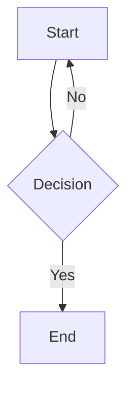

# mdoc

[](https://ko-fi.com/T6T1X1T51) 

A lightweight, minimalist documentation system that converts Markdown files to beautifully rendered web pages with support for math equations, code highlighting, search functionality, and interactive components.

## Features

- **Markdown to HTML conversion** with LaTeX math support via KaTeX
- **Clean, responsive design** for easy reading on any device
- **Built-in search functionality** for quick document navigation
- **Code syntax highlighting** for multiple programming languages
- **Version tracking** using Git history
- **Interactive components:**
  - GLSL shaders with live rendering and interaction
  - Mathematical graphing with Desmos
  - Diagrams and flowcharts with Mermaid
  - Geometry with GeoGebra
  - Creative coding with p5.js

## How to add a documentation

1. Fork the repository by clicking the 'Fork' button at the top right of the repository page
2. Clone your forked repository: `git clone https://github.com/YOUR-USERNAME/mdoc.git`
3. Create a new branch for your changes: `git checkout -b docs`
4. Make your changes:
   - Add your Markdown documentation files to the `templates/docs` directory
5. Commit your changes: `git commit -m "Add description of your changes"`
6. Push to your forked repository: `git push origin docs`
7. Create a pull request:
   - Go to the original repository
   - Click 'Pull Requests' and then 'New Pull Request'
   - Click 'Compare across forks'
   - Select your fork and branch
   - Click 'Create Pull Request'
   - Provide a clear description of your changes
8. Wait for review and respond to any feedback
9. Then when the pull request is merged, your documentation will be available on docs.meek-dev.com

## Documentation Format

Create your documentation in Markdown with the following features:

```markdown
# Document Title

Regular Markdown formatting works as expected.

## LaTeX Math

Inline math: $E = mc^2$

Display math:
$$
\frac{d}{dx}e^x = e^x
$$

## Interactive Components

### GLSL Shader
```glsl
// Your GLSL code here
```

### Desmos Graph
```desmos
{
  "expressionsList": [
    { "id": "graph1", "latex": "y=a\\sin(bx+c)+d" }
  ],
  "parameters": [
    { "id": "a", "name": "Amplitude", "min": 0.1, "max": 5, "default": 1 }
  ]
}
```

### Mermaid Diagram



Add me on Discord for help or questions - **@billetde20**
